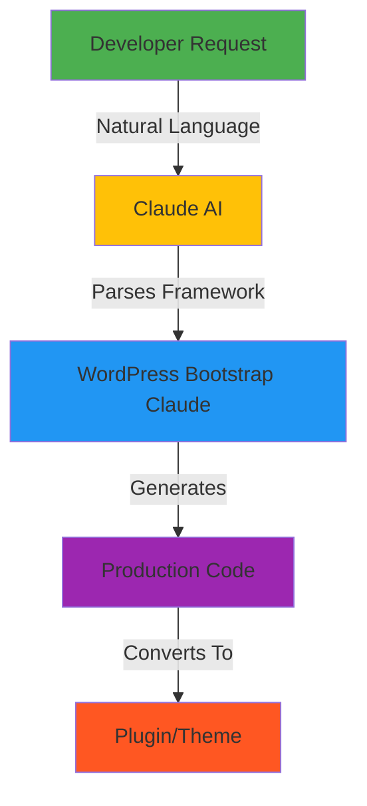
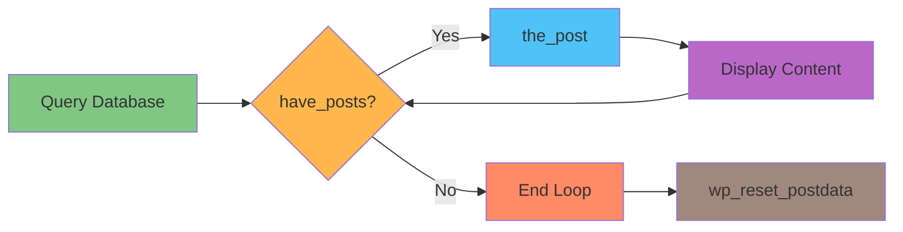
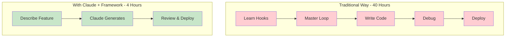
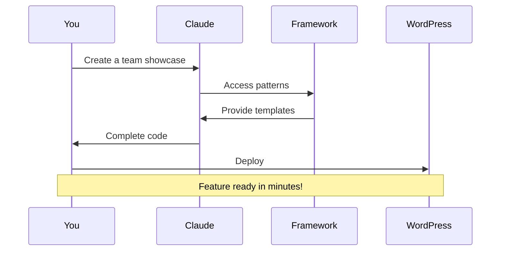
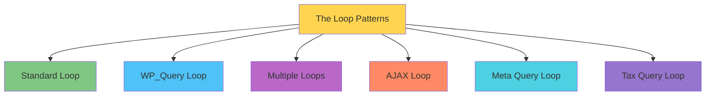
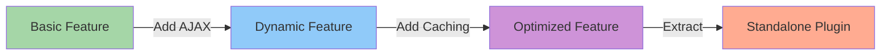
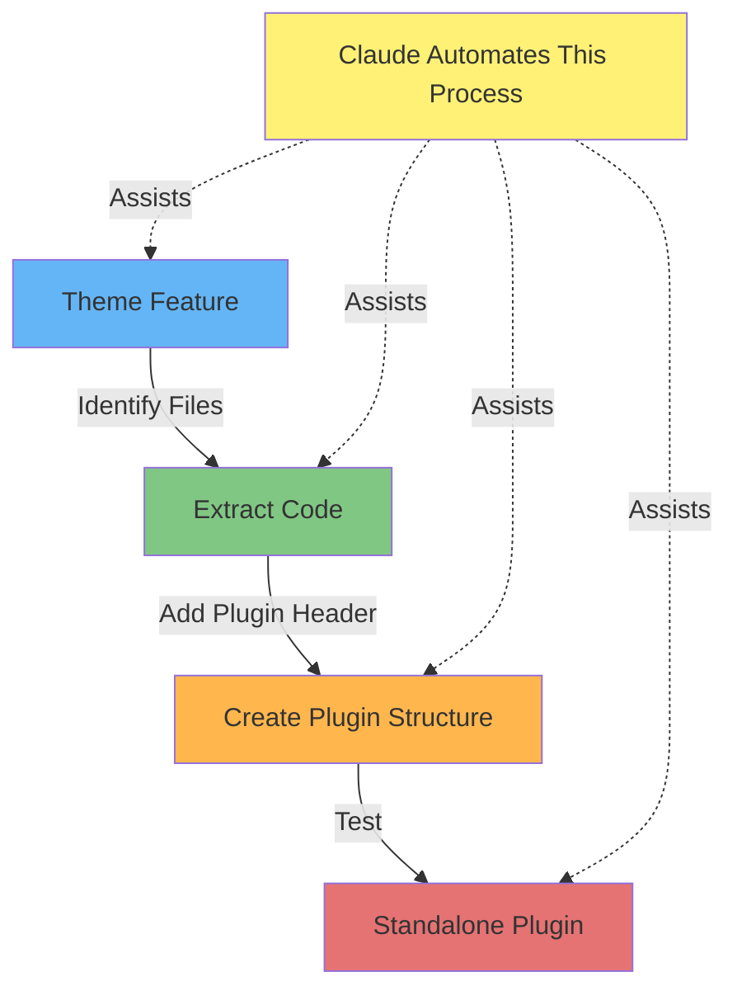
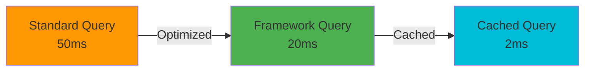
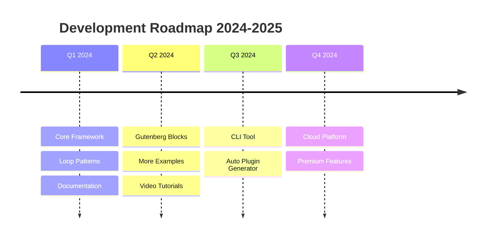

# 🚀 WordPress Bootstrap Claude - AI-Powered WordPress Development Framework

[](https://wordpress.org/)
[](https://getbootstrap.com/)
[](https://claude.ai)
[](https://www.gnu.org/licenses/gpl-2.0.html)
[](http://makeapullrequest.com)

> **Transform WordPress Development with AI** - The first framework designed specifically for developers working with Claude AI to build WordPress themes and plugins at unprecedented speed.

## 🎯 What Makes This Revolutionary

Traditional WordPress development requires years of experience. **We've changed that.** This framework provides AI-optimized patterns that Claude can understand, modify, and extend instantly.



## 🏗️ The WordPress Loop - Simplified

Understanding The Loop is crucial. Our framework makes it accessible to both developers and AI.



## 💡 How It Works

### Traditional Development vs AI-Powered Development



## 🚀 Quick Start

### Installation

```bash
# Clone the repository
git clone https://github.com/coryhubbell/wordpress-bootstrap-claude.git

# Move to themes directory
mv wordpress-bootstrap-claude /path/to/wp-content/themes/

# Activate in WordPress Admin
```

### Your First AI-Powered Feature



## 📚 What's Included

### 12+ Loop Patterns



### Framework Structure

```
wordpress-bootstrap-claude/
├── 📁 core/                 # Theme files
│   ├── functions.php       # Core functions
│   ├── index.php          # Main template
│   └── style.css          # Theme declaration
├── 📁 inc/                  # Includes
│   ├── loop-functions.php  # 500+ lines of helpers
│   └── nav-walker.php     # Bootstrap navigation
├── 📁 template-parts/       # Templates
│   └── loops/             # Loop patterns
├── 📁 examples/            # Working examples
│   ├── custom-post-type.php
│   ├── rest-api.php
│   └── ajax-handler.php
└── 📁 docs/                # Documentation
    ├── LOOP_GUIDE.md
    ├── CLAUDE_QUICKSTART.md
    └── PLUGIN_CONVERSION.md
```

## 🤖 Working with Claude AI

### Natural Language to Code

Tell Claude what you need in plain English:

> "Create a product catalog with filtering and cart functionality"

Claude will generate:
- ✅ Custom Post Type
- ✅ Taxonomies
- ✅ Display Loop
- ✅ AJAX Filtering
- ✅ Cart Integration

### Progressive Enhancement



## 💻 Code Examples

### Basic WordPress Loop
```php
<?php
// Ask Claude: "Enhance this with Bootstrap cards"
if ( have_posts() ) :
    while ( have_posts() ) : the_post();
        // Claude adds Bootstrap components
        // Claude adds lazy loading
        // Claude optimizes queries
        get_template_part( 'template-parts/content' );
    endwhile;
endif;
?>
```

### Custom Query Pattern
```php
<?php
// Tell Claude: "Get featured products with ratings"
$args = array(
    'post_type' => 'product',
    'meta_key' => 'featured',
    'meta_value' => 'yes',
    // Claude enhances with additional parameters
);
$query = new WP_Query( $args );
?>
```

## 🔄 Convert Features to Plugins



## 📈 Performance Metrics

### Development Speed Comparison

| Traditional WordPress | With Framework | With Claude + Framework |
|----------------------|----------------|------------------------|
| 40 hours | 10 hours | **4 hours** |
| Deep WP knowledge required | Basic WP knowledge | Describe what you want |
| Manual coding | Use templates | AI generates code |
| Extensive debugging | Pre-tested patterns | Production-ready code |

### Query Performance



## 🛠 Real-World Use Cases

### E-Commerce Site
```
Developer: "Create a product catalog with filters"
Claude generates → Complete WooCommerce-style system
```

### Portfolio Site
```
Developer: "Build a portfolio with Isotope filtering"
Claude generates → CPT + Isotope + AJAX loading
```

### Membership Site
```
Developer: "Add member profiles with social links"
Claude generates → User system + Meta fields + Display templates
```

## 🎯 Who Should Use This?

- **WordPress Developers** - Speed up development 10x
- **Agencies** - Deliver projects faster
- **Freelancers** - Take on more clients
- **AI Enthusiasts** - Leverage Claude effectively
- **Beginners** - Build professional sites quickly

## 🤝 Contributing


1. Fork the repository
2. Create your feature branch (`git checkout -b feature/AmazingFeature`)
3. Commit your changes (`git commit -m 'Add AmazingFeature'`)
4. Push to the branch (`git push origin feature/AmazingFeature`)
5. Open a Pull Request

## 📚 Documentation

- 📖 [**Loop Mastery Guide**](docs/LOOP_GUIDE.md) - Complete WordPress Loop documentation
- 🤖 [**Claude Integration Guide**](docs/CLAUDE_QUICKSTART.md) - AI development patterns
- 🔌 [**Plugin Conversion Guide**](docs/PLUGIN_CONVERSION.md) - Extract features to plugins
- 🎨 [**Theme Customization**](docs/CUSTOMIZATION.md) - Bootstrap and styling
- 🚀 [**Performance Guide**](docs/PERFORMANCE.md) - Optimization techniques

## 🔧 Technical Requirements

- **WordPress:** 5.9 or higher
- **PHP:** 7.4 or higher
- **Bootstrap:** 5.3 (included)
- **Claude AI:** Any tier

## ✨ Key Features

### For Developers
- ✅ 12+ Loop patterns ready to use
- ✅ 500+ lines of helper functions
- ✅ Complete Bootstrap 5 integration
- ✅ AJAX/REST API examples
- ✅ Plugin-ready architecture

### For AI Integration
- ✅ Claude-optimized documentation
- ✅ Clear code patterns
- ✅ Modular structure
- ✅ Conversion guides
- ✅ Natural language friendly

## 🚦 Roadmap



## 💬 Community & Support

- **Issues:** [Report bugs](https://github.com/coryhubbell/wordpress-bootstrap-claude/issues)
- **Discussions:** [Join community](https://github.com/coryhubbell/wordpress-bootstrap-claude/discussions)
- **Wiki:** [Extended docs](https://github.com/coryhubbell/wordpress-bootstrap-claude/wiki)

## ⚡ Quick Commands for Claude

### Create Custom Post Type
```
"Using WordPress Bootstrap Claude, create a custom post type for Events with calendar integration"
```

### Build REST API
```
"Add REST API endpoints for the Events with authentication"
```

### Implement AJAX Features
```
"Create infinite scroll for the blog posts with loading animation"
```

### Convert to Plugin
```
"Convert the Events feature into a standalone WordPress plugin"
```

## 🔐 Security Features

- ✅ Nonce verification on all AJAX calls
- ✅ Data sanitization throughout
- ✅ SQL injection prevention
- ✅ XSS protection
- ✅ CSRF protection

## 🌟 Why Choose This Framework?

| Traditional Development | With This Framework |
|------------------------|-------------------|
| ❌ Weeks of coding | ✅ Hours to deploy |
| ❌ Deep WP expertise needed | ✅ Claude does heavy lifting |
| ❌ Debug extensively | ✅ Pre-tested patterns |
| ❌ Start from scratch | ✅ Ready-to-use templates |
| ❌ Complex documentation | ✅ AI-friendly structure |

## 📜 License

GPL v2 or later - Same as WordPress

## 🙏 Acknowledgments

- **WordPress Community** - For the platform
- **Bootstrap Team** - For the framework
- **Anthropic** - For Claude AI
- **Contributors** - For improvements
- **You** - For embracing AI development

---

<div align="center">

### **Ready to Build WordPress Sites 10x Faster?**

**[⭐ Star This Repo](https://github.com/coryhubbell/wordpress-bootstrap-claude)** | **[📖 Read Docs](docs/)** | **[💬 Join Discussion](https://github.com/coryhubbell/wordpress-bootstrap-claude/discussions)**

**The future of WordPress development is AI-powered. Join us.**

</div>
