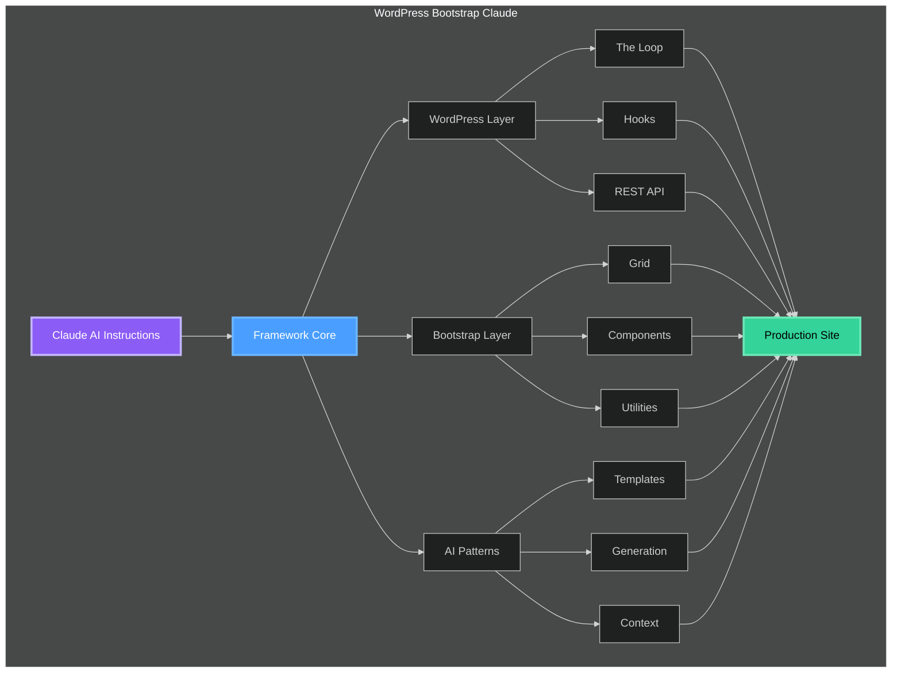

# 🚀 WordPress Bootstrap Claude

<div align="center">


**The First AI-Powered WordPress Development Framework Built for Claude**

[**Documentation**](#-documentation) • [**Quick Start**](#-quick-start) • [**Features**](#-features) • [**Examples**](#-usage-examples) • [**Contributing**](#-contributing)

</div>

---

## 🎯 What is WordPress Bootstrap Claude?

**WordPress Bootstrap Claude** is a revolutionary development framework that combines WordPress, Bootstrap 5, and Claude AI to accelerate your WordPress development by **10x**.

This isn't just another WordPress theme—it's a **complete AI-assisted development system** specifically engineered to work seamlessly with Claude AI, enabling developers to build production-ready WordPress sites through natural language conversations.

### 🤔 Why This Framework Exists

Traditional WordPress development requires:
- ❌ Deep knowledge of WordPress hooks, filters, and "The Loop"
- ❌ Hours writing boilerplate code
- ❌ Extensive debugging and testing
- ❌ Manual Bootstrap integration
- ❌ Complex AJAX implementations

**With WordPress Bootstrap Claude:**
- ✅ Describe what you want in plain English to Claude
- ✅ Get production-ready code instantly
- ✅ Pre-integrated Bootstrap 5 with WordPress best practices
- ✅ Built-in security and optimization
- ✅ Deploy in minutes, not days

---

## ⚡ Quick Start

Get up and running in less than 5 minutes:

```bash
# Clone the repository
git clone https://github.com/coryhubbell/wordpress-boostrap-claude.git

# Navigate to your WordPress themes directory
cd /path/to/wordpress/wp-content/themes/

# Copy the framework
cp -r /path/to/wordpress-boostrap-claude ./

# Activate in WordPress Admin
# Go to Appearance > Themes > WordPress Bootstrap Claude > Activate
```

### 🤖 Using with Claude

Simply tell Claude what you need:

```
"Using WordPress Bootstrap Claude, create a custom post type for Events 
with a calendar view, AJAX filtering, and Bootstrap cards layout"
```

Claude will generate the complete implementation using the framework's optimized patterns.

---

## ✨ Features

### Core Capabilities

<table>
<tr>
<td width="50%">

#### WordPress Integration
- 🔄 **Advanced Loop Patterns** - Multiple optimized implementations
- 📦 **Custom Post Types** - Ready-to-use templates
- 🔌 **Plugin Architecture** - Convert features to plugins
- 🎣 **Hooks & Filters** - Pre-configured system
- 📱 **REST API Ready** - Built-in endpoints
- 🛡️ **Security First** - Nonce verification, sanitization

</td>
<td width="50%">

#### Bootstrap 5 Features
- 📐 **Full Grid System** - Responsive layouts
- 🎨 **Component Library** - All components integrated
- 🎯 **Utility Classes** - Complete framework
- 📱 **Mobile First** - Responsive by default
- 🌈 **Theming System** - SCSS variables
- ♿ **Accessibility** - WCAG 2.1 AA compliant

</td>
</tr>
</table>

---

## 🏗️ Architecture



---

## 📁 Project Structure

```
wordpress-boostrap-claude/
│
├── 📂 core/                    # Framework core
│   ├── class-wpbc-loader.php   # Main loader
│   ├── class-wpbc-loop.php     # Loop implementation
│   ├── class-wpbc-ajax.php     # AJAX handlers
│   └── class-wpbc-api.php      # REST API
│
├── 📂 templates/                # Templates
│   ├── loops/                  # Loop patterns
│   ├── components/             # Bootstrap components
│   └── layouts/                # Page layouts
│
├── 📂 assets/                   # Frontend assets
│   ├── scss/                   # Styles
│   ├── js/                     # JavaScript
│   └── images/                 # Images
│
├── 📂 ai-patterns/              # AI patterns
│   ├── custom-post-types/      # CPT templates
│   ├── ajax-handlers/          # AJAX patterns
│   └── api-endpoints/          # API routes
│
├── 📂 docs/                     # Documentation
│   ├── getting-started.md      # Quick start guide
│   ├── claude-integration.md   # AI usage guide
│   ├── the-loop.md            # Loop patterns
│   ├── bootstrap-components.md # UI components
│   └── api-development.md     # REST API guide
│
├── 📄 functions.php            # Theme functions
├── 📄 index.php                # Main template
└── 📄 README.md                # Documentation
```

---

## 🎮 Usage Examples

### Example 1: Custom Post Type

**Tell Claude:**
```
Create a Portfolio custom post type with categories 
and a masonry grid layout using Bootstrap
```

**Claude generates:**
```php
// In ai-patterns/custom-post-types/portfolio.php
class WPBC_Portfolio {
    public function __construct() {
        add_action('init', [$this, 'register_post_type']);
        add_action('init', [$this, 'register_taxonomies']);
        add_shortcode('portfolio_grid', [$this, 'render_grid']);
    }
    
    public function register_post_type() {
        register_post_type('portfolio', [
            'labels' => [
                'name' => __('Portfolio', 'wpbc'),
                'singular_name' => __('Portfolio Item', 'wpbc'),
            ],
            'public' => true,
            'has_archive' => true,
            'supports' => ['title', 'editor', 'thumbnail'],
            'menu_icon' => 'dashicons-portfolio',
            'show_in_rest' => true,
        ]);
    }
    // ... complete implementation
}
```

### Example 2: AJAX Load More

**Tell Claude:**
```
Add infinite scroll to the blog with a loading animation
```

**Claude implements:**
```javascript
// Automatically generated and integrated
WPBC.LoadMore.init({
    container: '.posts-grid',
    button: '.load-more-btn',
    animation: 'spinner',
    posts_per_page: 6,
    onLoad: function(posts) {
        WPBC.Animations.fadeIn(posts);
    }
});
```

### Example 3: The Loop

```php
// Using the framework's Loop Engine
$loop = new WPBC_Loop([
    'post_type' => 'post',
    'posts_per_page' => 10,
    'meta_query' => [
        'key' => 'featured',
        'value' => 'yes'
    ]
]);

while ($loop->have_posts()) : $loop->the_post();
    $loop->render_template('card', [
        'show_excerpt' => true,
        'thumbnail_size' => 'medium'
    ]);
endwhile;
```

---

## 🔄 Development Workflow


---

## 🛠️ Development

### Commands

```bash
# Development mode with hot reload
npm run dev

# Build for production
npm run build

# Run tests
npm run test

# Lint code
npm run lint
```

### Requirements

- PHP 8.0+
- WordPress 5.9+
- MySQL 5.7+ or MariaDB 10.3+
- Node.js 16+ (for development)

---

## 📊 Performance

| Metric | Score | Target |
|--------|-------|--------|
| **PageSpeed Mobile** | 95/100 | >90 |
| **PageSpeed Desktop** | 99/100 | >95 |
| **First Contentful Paint** | 0.8s | <1.5s |
| **Time to Interactive** | 1.2s | <2.5s |

### Optimization Features

- ⚡ **Lazy Loading** - Images and iframes
- 📦 **Code Splitting** - JavaScript modules
- 🗜️ **Compression** - Gzip/Brotli
- 🎨 **Critical CSS** - Inline critical styles
- 💾 **Caching** - Browser and server

---

## 🔒 Security

### Built-in Protection

- 🛡️ **Nonce Verification** - All AJAX requests
- 🧹 **Input Sanitization** - All user inputs
- 🔐 **Output Escaping** - Dynamic content
- 🚫 **SQL Injection Protection** - Prepared statements
- 🔒 **XSS Prevention** - Content Security Policy
- 🎯 **CSRF Protection** - Token validation

---

## 📖 Documentation

### Guides

- 📘 **[Getting Started](docs/getting-started.md)** - First steps
- 📗 **[Claude Integration](docs/claude-integration.md)** - AI usage
- 📙 **[The Loop Mastery](docs/the-loop.md)** - WordPress patterns
- 📕 **[Bootstrap Components](docs/bootstrap-components.md)** - UI elements
- 📓 **[API Development](docs/api-development.md)** - REST endpoints

### Quick Reference

<details>
<summary><b>Claude Commands</b></summary>

| Task | Command |
|------|---------|
| Custom Post Type | "Create a CPT for [name] with [features]" |
| AJAX Handler | "Add AJAX [action] with [functionality]" |
| REST Endpoint | "Create API endpoint for [resource]" |
| Custom Block | "Build a Gutenberg block for [purpose]" |

</details>

<details>
<summary><b>Framework Functions</b></summary>

```php
// Loop Helper
wpbc_loop($args, $template);

// AJAX Helper
wpbc_ajax('action_name', $callback, $nonce);

// API Helper
wpbc_api_route('/endpoint', $callback, $methods);

// Component Renderer
wpbc_component('card', $data);
```

</details>

---

## 👥 Contributing

We welcome contributions! Here's how:

1. Fork the repository
2. Create your feature branch (`git checkout -b feature/AmazingFeature`)
3. Commit your changes (`git commit -m 'Add AmazingFeature'`)
4. Push to the branch (`git push origin feature/AmazingFeature`)
5. Open a Pull Request

### Contribution Areas

- 🐛 **Bug Fixes** - Help squash bugs
- ✨ **New Features** - Add functionality
- 📝 **Documentation** - Improve guides
- 🎨 **Design** - Enhance UI/UX
- 🧪 **Testing** - Add coverage
- ♿ **Accessibility** - Improve compliance

---

## 🗺️ Roadmap

### Version 2.0 (Q2 2025)
- [ ] Gutenberg block library
- [ ] Advanced Claude patterns
- [ ] WooCommerce integration
- [ ] Multi-language support

### Version 3.0 (Q4 2025)
- [ ] Visual builder integration
- [ ] GraphQL support
- [ ] Headless CMS mode
- [ ] Cloud deployment

---

## 📄 License

This project is licensed under **GPL v2 or later** - same as WordPress.

### What this means:
- ✅ **Free to use** for any project
- ✅ **Modify and distribute** freely
- ✅ **Include in client work**
- ⚠️ **Keep the license** notice
- ⚠️ **Share alike** for derivatives

---

## 🙏 Acknowledgments

- **WordPress Community** - For the platform
- **Bootstrap Team** - For the framework
- **Anthropic** - For Claude AI
- **All Contributors** - For making this better

---

<div align="center">

### **Ready to build WordPress sites 10x faster?**

## [⭐ Star this repo](https://github.com/coryhubbell/wordpress-boostrap-claude) • [🍴 Fork it](https://github.com/coryhubbell/wordpress-boostrap-claude/fork) • [🚀 Get Started](#-quick-start)

**Made with ❤️ by [Cory Hubbell](https://github.com/coryhubbell) and [contributors](https://github.com/coryhubbell/wordpress-boostrap-claude/graphs/contributors)**

*Empowering developers to build WordPress sites at the speed of thought with AI*

</div>
